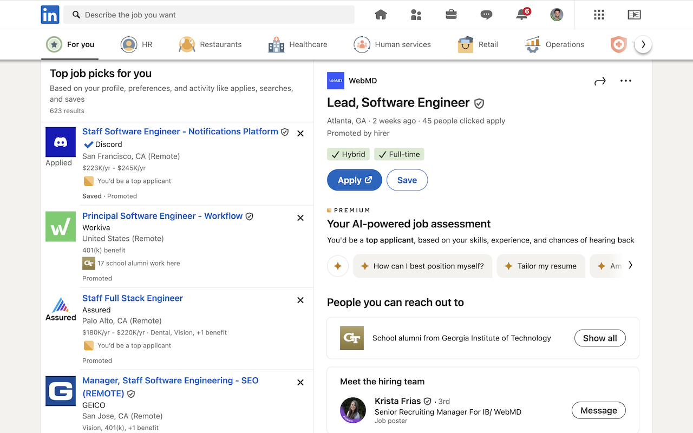

# LinkedIn JobTracker

Track your LinkedIn job applications with visible checkmarks and reminders for companies you've already applied to.

[Add to Chrome](https://chromewebstore.google.com/detail/dpanfnmgfeffajbcdnknboebelcjecdc?utm_source=item-share-cb)

## Description
JobTracker integrates with LinkedIn to highlight companies you've already applied to. Without JobTracker, LinkedIn only highlights the jobs you've applied to but not the companies.

### How it works:

After you click "Apply" in LinkedIn, you're asked:

> Did you apply?
> Let us know, and we’ll help you track your application.

Any applications you click "Yes" to are tracked by LinkedIn while JobTracker tracks the companies.

For now, you have to sync JobTracker by clicking its icon in the toolbar. This opens up a tab in the background to capture the companies you've applied to.

*<small>LinkedIn JobTracker is in development and yet fully-featured. Expect more to come!</small>

## Screenshots



## How to build
```shell
just build
```

If you don't have `just` you can get it [here](https://github.com/casey/just).
